# Spendly Product and Technical Specification

## 1. Product Definition

Spendly is a full-stack web app for a school project. It helps users manually log shopping receipts, compare prices fairly across stores, view price trends from their own receipt history, upload optional receipt images, and split receipt costs with other logged-in users.

Spendly is not a public price crawler. Every price shown in the app comes from user-entered receipt data.

### 1.1 System Context Diagram

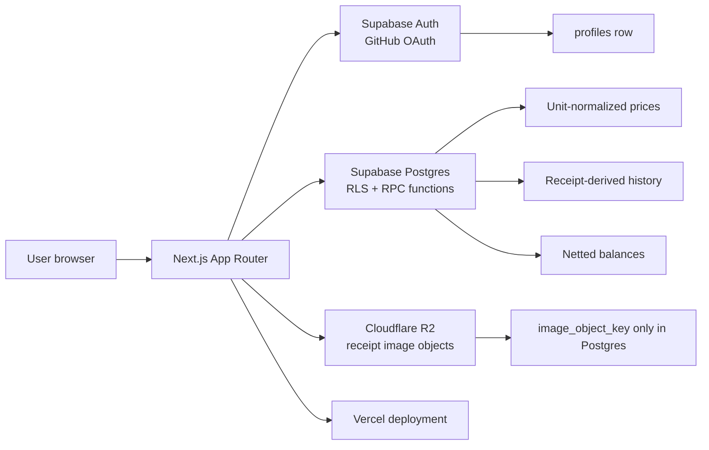

## 2. Success Criteria

Spendly is successful when a grader can:
- Sign in with GitHub.
- Create a receipt with store, date, totals, and multiple line items.
- Store a receipt image in Cloudflare R2 while Postgres stores only object metadata.
- Normalize item prices by unit, such as `$4 / 500g` into `$8 / kg`.
- Compare one product across two stores using latest normalized unit prices.
- View product price history over time from receipts.
- Split a receipt or line item with other users.
- See netted balances, such as `A owes B $5`, not duplicate opposing debts.
- Confirm database has at least 5 relational tables.

## 3. Fixed Technology

Do not replace these technologies:
- Next.js App Router.
- TypeScript.
- Tailwind CSS.
- Supabase Postgres.
- Supabase Auth with GitHub OAuth.
- Cloudflare R2 object storage.
- Vercel deployment.

Current package versions:
- `next`: `16.2.10`
- `react`: `19.2.4`
- `@supabase/ssr`: `^0.12.0`
- `@supabase/supabase-js`: `^2.110.0`
- `@aws-sdk/client-s3`: `^3.1079.0`
- `@aws-sdk/s3-request-presigner`: `^3.1079.0`

## 4. Non-Goals

Do not build these unless requested later:
- OCR scanning.
- External price scraping.
- Store API integration.
- Persistent household/group model.
- Push/email notifications.
- Multi-currency support.
- Item-level tax allocation.
- Inventory management.
- Budget planning.
- Public social sharing.

## 5. Users and Auth

### 5.1 User Model

Supabase Auth owns authentication. Spendly mirrors auth users into `public.profiles`.

`profiles.id` equals `auth.users.id`.

### 5.2 Auth Flow

Routes:
- `/login`: login page with GitHub CTA.
- `/auth/sign-in`: starts Supabase GitHub OAuth.
- `/auth/callback`: exchanges OAuth code for session.
- `/dashboard`: protected dashboard shell.

Server behavior:
- `src/lib/supabase/server.ts` creates cookie-based Supabase server client.
- `src/lib/supabase/client.ts` creates browser client.
- `src/lib/supabase/middleware.ts` refreshes auth session.
- `middleware.ts` applies session middleware broadly.

Auth flow diagram:

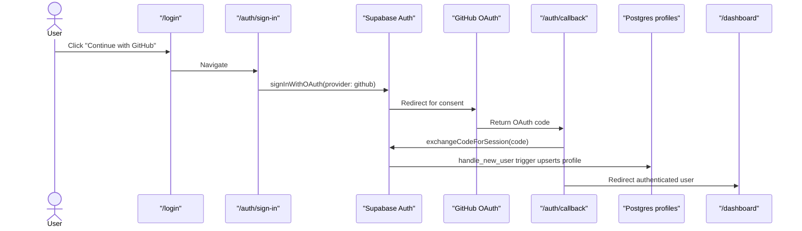

### 5.3 Auth Requirements

- Only authenticated users can access private app data.
- Server routes must call `supabase.auth.getUser()` before protected work.
- RLS must stay enabled on app tables.
- Never trust client-supplied `owner_user_id`; derive from `auth.uid()` or authenticated user.

## 6. Database Source of Truth

Database source file:

```text
supabase/schema.sql
```

The schema contains:
- Extensions: `pgcrypto`, `citext`.
- Enums:
  - `spendly_unit_category`: `mass`, `volume`, `each`.
  - `spendly_unit`: `g`, `kg`, `ml`, `l`, `each`.
  - `spendly_split_method`: `even`, `custom`.
- 7 core tables.
- Indexes.
- Triggers.
- RLS policies.
- Helper functions for normalization, split creation, price comparison, price history, settlement, and balances.

### 6.1 Database ERD

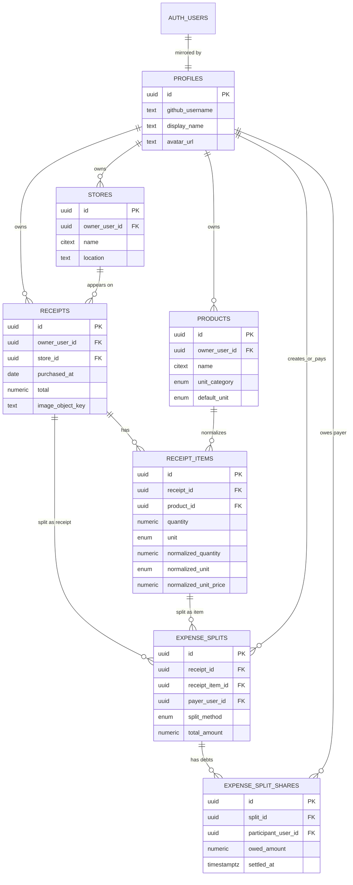

## 7. Core Tables

### 7.1 `profiles`

Purpose: app profile linked to Supabase Auth user.

Columns:
- `id uuid primary key references auth.users(id) on delete cascade`
- `github_username text unique`
- `display_name text`
- `avatar_url text`
- `created_at timestamptz not null default now()`
- `updated_at timestamptz not null default now()`

Important behavior:
- `handle_new_user()` inserts/updates profile after auth user creation.
- Users can select profiles for split participant search.

### 7.2 `stores`

Purpose: user-owned store catalog.

Columns:
- `id uuid primary key default gen_random_uuid()`
- `owner_user_id uuid not null references profiles(id) on delete cascade`
- `name citext not null`
- `location text`
- `created_at timestamptz not null default now()`
- `updated_at timestamptz not null default now()`

Constraints:
- Store name cannot be blank.
- Store names unique per owner.

### 7.3 `products`

Purpose: normalized product identity across receipt items.

Columns:
- `id uuid primary key default gen_random_uuid()`
- `owner_user_id uuid not null references profiles(id) on delete cascade`
- `name citext not null`
- `unit_category spendly_unit_category not null`
- `default_unit spendly_unit not null`
- `created_at timestamptz not null default now()`
- `updated_at timestamptz not null default now()`

Constraints:
- Product name cannot be blank.
- Product names unique per owner.
- `mass` products default to `kg`.
- `volume` products default to `l`.
- `each` products default to `each`.

Rationale:
- Product table is required for reliable history and comparison.
- Simple string matching would be easier but wrong for repeated variants like `Milk`, `milk`, `Whole Milk 1L`.

### 7.4 `receipts`

Purpose: receipt header.

Columns:
- `id uuid primary key default gen_random_uuid()`
- `owner_user_id uuid not null references profiles(id) on delete cascade`
- `store_id uuid not null references stores(id) on delete restrict`
- `purchased_at date not null`
- `subtotal numeric(12,2) not null`
- `tax numeric(12,2) not null default 0`
- `total numeric(12,2) not null`
- `image_object_key text`
- `image_public_url text`
- `notes text`
- `created_at timestamptz not null default now()`
- `updated_at timestamptz not null default now()`

Rules:
- Amounts cannot be negative.
- Store must belong to receipt owner.
- `image_object_key` is Cloudflare R2 object key.
- No binary image data goes into Postgres.

### 7.5 `receipt_items`

Purpose: receipt line items with raw entry and normalized price.

Columns:
- `id uuid primary key default gen_random_uuid()`
- `receipt_id uuid not null references receipts(id) on delete cascade`
- `product_id uuid not null references products(id) on delete restrict`
- `line_number integer not null`
- `raw_name text not null`
- `quantity numeric(12,3) not null`
- `unit spendly_unit not null`
- `normalized_quantity numeric(12,3) not null`
- `normalized_unit spendly_unit not null`
- `line_total numeric(12,2) not null`
- `normalized_unit_price numeric(12,4) not null`
- `created_at timestamptz not null default now()`
- `updated_at timestamptz not null default now()`

Rules:
- `line_number` positive.
- `raw_name` not blank.
- `quantity` positive.
- `line_total` non-negative.
- Unique `(receipt_id, line_number)`.
- Product must belong to receipt owner.
- Trigger computes normalized quantity/unit/unit price before insert/update.

Normalization:
- `g` -> `kg`
- `kg` -> `kg`
- `ml` -> `l`
- `l` -> `l`
- `each` -> `each`

Formula:

```text
normalized_unit_price = round(line_total / normalized_quantity, 4)
```

Receipt item normalization flow:

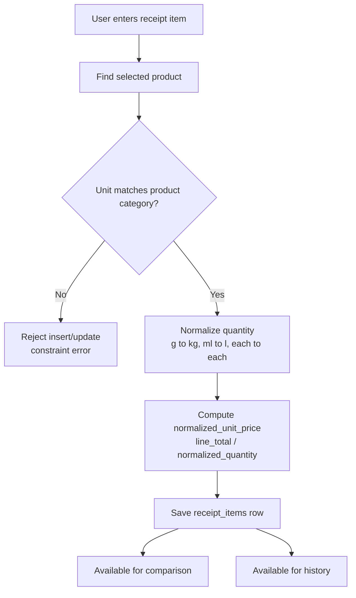

### 7.6 `expense_splits`

Purpose: one split event for a receipt or one receipt item.

Columns:
- `id uuid primary key default gen_random_uuid()`
- `receipt_id uuid not null references receipts(id) on delete cascade`
- `receipt_item_id uuid references receipt_items(id) on delete cascade`
- `created_by_user_id uuid not null references profiles(id) on delete cascade`
- `payer_user_id uuid not null references profiles(id) on delete cascade`
- `split_method spendly_split_method not null`
- `total_amount numeric(12,2) not null`
- `created_at timestamptz not null default now()`
- `updated_at timestamptz not null default now()`

Rules:
- `total_amount > 0`.
- In current base schema, payer must equal creator.
- Split target amount must equal receipt total or receipt item line total.

### 7.7 `expense_split_shares`

Purpose: debts owed by non-payers to payer.

Columns:
- `id uuid primary key default gen_random_uuid()`
- `split_id uuid not null references expense_splits(id) on delete cascade`
- `participant_user_id uuid not null references profiles(id) on delete cascade`
- `owed_amount numeric(12,2) not null`
- `settled_at timestamptz`
- `settled_by_user_id uuid references profiles(id) on delete set null`
- `created_at timestamptz not null default now()`
- `updated_at timestamptz not null default now()`

Rules:
- `owed_amount > 0`.
- Unique `(split_id, participant_user_id)`.
- `participant_user_id` must not equal `payer_user_id`.
- Payer never has a share row.

## 8. Database Functions

### 8.1 Auth/Profile

`handle_new_user()`
- Triggered after insert on `auth.users`.
- Creates/updates `profiles`.
- Pulls GitHub metadata from `raw_user_meta_data`.

### 8.2 Unit Normalization

`spendly_unit_category_for_unit(p_unit)`
- Maps unit to category.

`set_receipt_item_normalized_fields()`
- Validates product category vs entered unit.
- Writes normalized quantity, normalized unit, and normalized unit price.

### 8.3 Ownership Validation

`validate_receipt_store_owner()`
- Prevents receipt from using another user's store.

`validate_receipt_item_product_owner()`
- Prevents receipt item from using another user's product.

### 8.4 Splits

`spendly_split_target_amount(p_receipt_id, p_receipt_item_id)`
- Returns receipt total if item id is null.
- Returns item line total if item id exists.

`create_even_expense_split(p_receipt_id, p_receipt_item_id, p_participant_user_ids)`
- Authenticated RPC.
- Creates split where current user is creator and payer.
- Requires at least one non-payer participant.
- Rejects duplicate participants.
- Rejects payer as participant.
- Creates one share row per non-payer.

`create_custom_expense_split(p_receipt_id, p_receipt_item_id, p_payer_share_amount, p_shares)`
- Authenticated RPC.
- `p_shares` is JSON array:

```json
[
  {
    "participant_user_id": "uuid",
    "owed_amount": 12.34
  }
]
```

- Validates `sum(owed_amount) + payer_share_amount = target amount`.

`mark_split_share_settled(p_share_id)`
- Authenticated RPC.
- Share participant, payer, or creator may mark settled.
- Sets `settled_at` and `settled_by_user_id`.

Split creation and balance derivation:

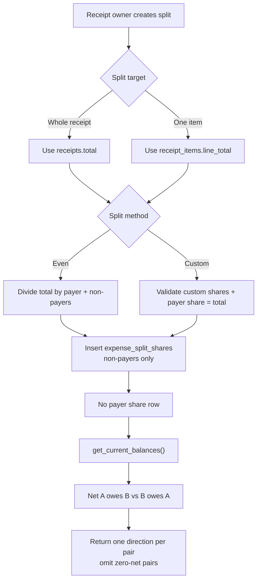

### 8.5 Price Comparison

`get_latest_product_price(p_product_id, p_store_id, p_normalized_unit)`
- Returns latest matching receipt item.
- Filters by product, store, and optional normalized unit.
- Ordering:
  1. `receipts.purchased_at desc`
  2. `receipts.created_at desc`
  3. `receipt_items.line_number asc`

`compare_product_between_stores(p_product_id, p_store_a_id, p_store_b_id, p_normalized_unit)`
- Returns latest price rows for store A and store B.
- API/UI should calculate winner from `normalized_unit_price`.

Price comparison flow:

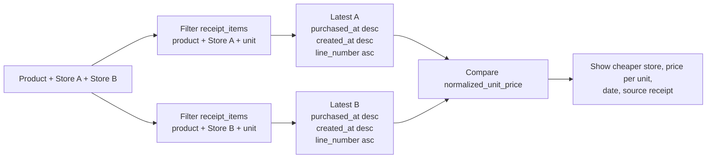

### 8.6 Price History

`get_product_price_history(p_product_id, p_normalized_unit)`
- Returns receipt item price series sorted by purchase date.
- Only receipt-derived data is allowed.

History data flow:

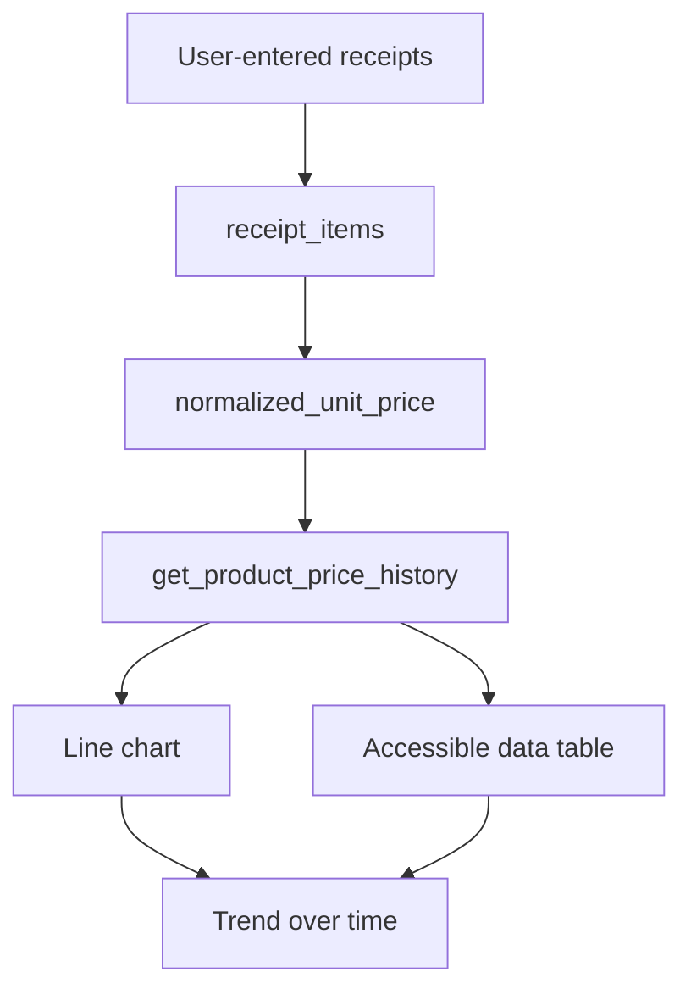

### 8.7 Balances

`get_current_balances()`
- Returns netted unsettled balances for current user.
- Pairs opposing debts and returns one direction only.
- Omits zero-net pairs.

Example:

```text
A owes B $10
B owes A $5
=> A owes B $5
```

## 9. RLS Model

All app tables have RLS enabled.

Policies:
- `profiles`: authenticated users can select profiles; users insert/update own profile.
- `stores`: owner can manage own stores.
- `products`: owner can manage own products.
- `receipts`: owner can manage own receipts.
- `receipt_items`: owner can manage items through receipt ownership.
- `expense_splits`: accessible to creator, payer, or share participant.
- `expense_split_shares`: accessible to users who can access parent split.

Important implementation rule:
- Server code must still check authenticated user before route work.
- RLS is final protection, not replacement for route validation.

## 10. Routes

Implemented:
- `/`
- `/login`
- `/dashboard`
- `/auth/sign-in`
- `/auth/callback`
- `/api/receipt-images/presign`
- `/api/receipt-images/[receiptId]`

Planned:
- `/receipts/new`
- `/receipts/[id]`
- `/compare`
- `/products/[id]/history`
- `/splits/[id]`
- `/balances`
- `/settings`

## 11. API Contracts

### 11.1 `POST /api/receipt-images/presign`

Purpose: create short-lived R2 upload URL.

Auth: required.

Request:

```json
{
  "contentType": "image/jpeg",
  "fileSize": 123456
}
```

Validation:
- `contentType` must be `image/jpeg`, `image/png`, or `image/webp`.
- `fileSize` must be greater than `0`.
- `fileSize` must be `<= 5MB`.

Response:

```json
{
  "objectKey": "receipts/<user-id>/<uuid>.jpg",
  "uploadUrl": "https://..."
}
```

R2 upload flow:

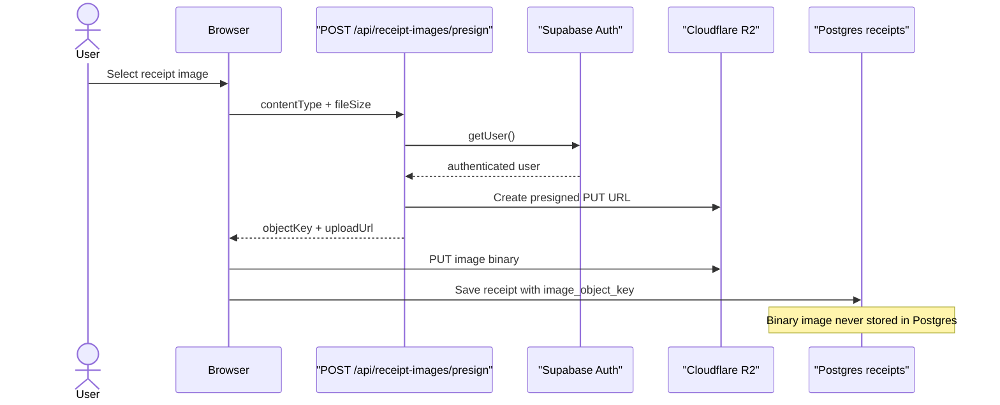

### 11.2 `GET /api/receipt-images/[receiptId]`

Purpose: return short-lived signed R2 view URL for receipt image.

Auth: required.

Lookup:
- `receipts.id = receiptId`
- `receipts.owner_user_id = user.id`
- `receipts.image_object_key is not null`

Response:

```json
{
  "viewUrl": "https://..."
}
```

### 11.3 Planned Receipt API

Preferred implementation: server actions or route handlers.

Create receipt input:

```ts
type CreateReceiptInput = {
  store: {
    id?: string;
    name?: string;
    location?: string | null;
  };
  purchasedAt: string;
  subtotal: number;
  tax: number;
  total: number;
  imageObjectKey?: string | null;
  notes?: string | null;
  items: Array<{
    productId?: string;
    productName?: string;
    unitCategory?: "mass" | "volume" | "each";
    rawName: string;
    quantity: number;
    unit: "g" | "kg" | "ml" | "l" | "each";
    lineTotal: number;
  }>;
};
```

Create receipt behavior:
- Upsert/create store owned by current user.
- Upsert/create products owned by current user.
- Insert receipt.
- Insert receipt items with sequential line numbers.
- Let DB trigger compute normalized fields.

### 11.4 Planned Comparison API

Input:

```ts
type CompareInput = {
  productId: string;
  storeAId: string;
  storeBId: string;
  normalizedUnit?: "kg" | "l" | "each";
};
```

Use RPC:
- `compare_product_between_stores(...)`

Output:

```ts
type CompareResult = {
  productId: string;
  normalizedUnit: "kg" | "l" | "each";
  stores: Array<{
    label: "a" | "b";
    storeId: string;
    storeName: string;
    normalizedUnitPrice: number | null;
    purchasedAt: string | null;
    receiptId: string | null;
    receiptItemId: string | null;
  }>;
};
```

### 11.5 Planned Split API

Prefer calling DB RPCs:
- `create_even_expense_split`
- `create_custom_expense_split`
- `mark_split_share_settled`
- `get_current_balances`

No `net_balances` table.

API and RPC responsibility map:

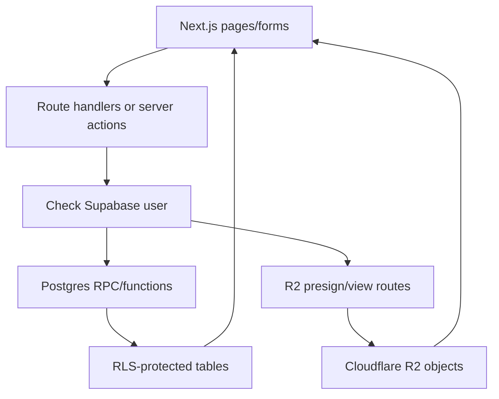

## 12. UX Requirements

General:
- Mobile-first layout.
- No horizontal scroll at 375px width.
- Touch targets at least 44px high.
- Visible focus states.
- Form fields need visible labels, not placeholder-only labels.
- Errors appear near the relevant field.
- Destructive actions require confirmation.

Dashboard:
- Show recent receipts.
- Show quick actions.
- Show current net balances summary.

Receipt form:
- Multi-section form:
  1. Store and date.
  2. Totals.
  3. Line items.
  4. Optional image.
  5. Review/save.
- Quantity/unit/line total must be easy to enter.
- Show computed normalized price preview before save when possible.

Comparison:
- Select product.
- Select two stores.
- Show latest normalized unit prices.
- Show date and source receipt for each result.
- If one store lacks data, show clear empty state.

History:
- Use line chart for trend.
- Also provide accessible table.
- Axis labels include unit, such as `$ / kg`.

Splits:
- Show payer.
- Show participants.
- For even split, show computed amount per non-payer.
- For custom split, validate total before submit.
- Settlement action must be clear and reversible only by editing DB/admin unless future undo is implemented.

## 13. UI Design System

Use Spendly as a quiet productivity/finance tool, not a marketing-heavy site.

Design tokens:
- Background: slate-100 for app shell, white for panels.
- Text: slate-950 primary, slate-600 secondary.
- Primary action: slate-950 on light background.
- Accent: emerald-600/700 for savings, success, comparison win.
- Border: slate-300.
- Danger: red-600.

Typography:
- Current: Geist from Next font.
- Acceptable future direction: Lexend headings + Source Sans 3 body if project wants more personality.

Shape:
- Radius: 8px max for cards/buttons unless component demands otherwise.
- Avoid nested cards.
- Use full-width page bands and simple panels.

Charts:
- Trend: line chart.
- Store comparison: two-column bar or side-by-side metric cards.
- Balances: list/table, not chart.

Primary screen map:

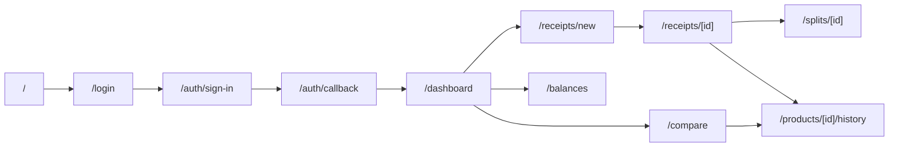

## 14. Environment Variables

Public:
- `NEXT_PUBLIC_SUPABASE_URL`
- `NEXT_PUBLIC_SUPABASE_ANON_KEY`

Server-only:
- `CLOUDFLARE_R2_ACCOUNT_ID`
- `CLOUDFLARE_R2_ACCESS_KEY_ID`
- `CLOUDFLARE_R2_SECRET_ACCESS_KEY`
- `CLOUDFLARE_R2_BUCKET`

Never expose R2 keys in client components.

## 15. Build and Quality Gates

Run before handoff:

```bash
npm run lint
npm run build
```

Expected:
- ESLint passes.
- Next build passes.
- No TypeScript errors.

Manual smoke checks after env setup:
- `/` renders.
- `/login` renders.
- GitHub OAuth redirects.
- `/dashboard` redirects unauthenticated users.
- Authenticated user reaches dashboard.
- R2 presign rejects unauthenticated requests.
- R2 presign rejects invalid file types.

## 16. AI Implementation Instructions

When another AI continues this project:

1. Read files in this order:
   - `AGENTS.md`
   - `SPECS.md`
   - `DESIGN.md`
   - `TODO.md`
   - `supabase/schema.sql`
2. Do not change tech stack.
3. Do not add out-of-scope features.
4. Build one vertical slice at a time.
5. Prefer DB RPCs already present in `supabase/schema.sql`.
6. Keep route handlers/server actions thin.
7. Let the database enforce unit normalization and split invariants.
8. Run `npm run lint` and `npm run build` before final response.

Implementation build order:

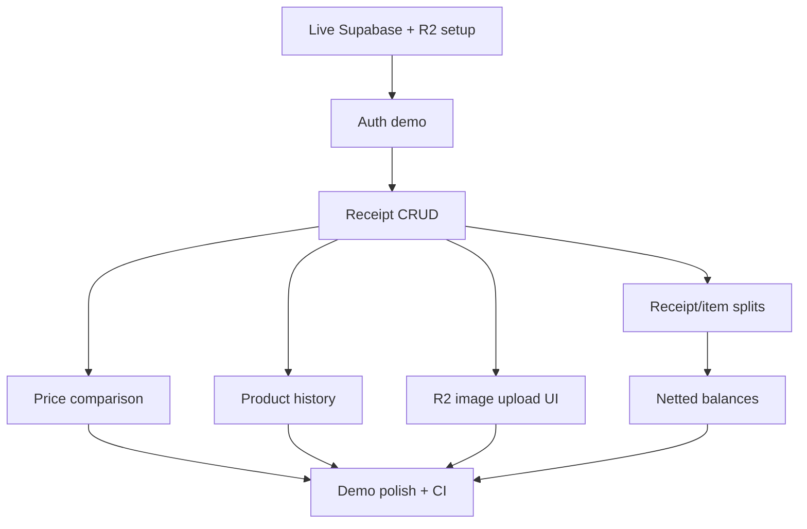
