# Spendly Product and Technical Specification

## 1. Product Definition

Spendly is a full-stack web app for a school project. It helps users compare prices before buying, log receipts after buying, review receipt-derived price insights, split shared costs, configure how they receive money, and settle debts with payment proof.

Spendly supports two equal first-class daily workflows:
- Compare-first: decide what to buy now.
- Receipt-first: log what was bought quickly and reliably.

Spendly is not a public price crawler. Saved price insights and history come only from user-entered receipt data. Manual compare remains available for pre-purchase decisions.

## 2. Success Criteria

Spendly is successful when a grader can:
- Sign in with GitHub.
- Reach a dashboard that clearly exposes both compare and receipt workflows.
- Run a quick manual compare before buying.
- Turn a compare result into a receipt draft.
- Save and resume receipt drafts across devices.
- Create a final receipt with store, date, totals, items, and optional images.
- View receipt-derived price history and receipt-derived compare insights.
- Create a split from a receipt or line item.
- See balances inside the Splits area, netted from unsettled or unconfirmed shares.
- Configure receiving payment methods, including optional QR image uploads.
- Submit a payment slip for a share and have the receiver confirm or reject it.
- Verify that images live in Cloudflare R2 and Postgres stores metadata only.

## 3. Fixed Technology

Do not replace these technologies:
- Next.js App Router
- TypeScript
- Tailwind CSS
- Supabase Postgres
- Supabase Auth with GitHub OAuth
- Cloudflare R2 object storage
- Vercel deployment

## 4. Non-Goals

Do not build these unless requested later:
- OCR scanning
- External price scraping
- Store API integration
- Persistent household/group model
- Push/email notifications
- Multi-currency support
- Item-level tax allocation
- Inventory management
- Budget planning
- Public social sharing

## 5. Product Structure

Authenticated users land on `/dashboard`.

Top-level app navigation:
- `/dashboard`
- `/compare`
- `/receipts`
- `/splits`
- `/settings`

Navigation responsibilities:
- Dashboard: operational home for both primary workflows and pending actions.
- Compare: manual compare plus receipt-derived insights.
- Receipts: final receipts plus visible draft management.
- Splits: debt, balances, payment proof, and settlement review.
- Settings: theme, language, profile, payment methods, QR uploads.

`/balances` is no longer a primary destination. It may remain as a compatibility route or redirect, but balances belong under Splits.

## 6. Auth and Ownership

Supabase Auth owns authentication. Spendly mirrors users into `public.profiles`.

Requirements:
- Only authenticated users access private app data.
- Server routes must call `supabase.auth.getUser()` before protected work.
- RLS stays enabled on all app tables.
- Never trust client-supplied ownership fields.
- R2 server credentials must never reach the browser.
- Split participants may view source receipts and receipt/item images for splits they are involved in, but source receipt edits remain owner-only.

## 7. Database Source of Truth

Database source file:

```text
supabase/schema.sql
```

The schema includes:
- Core product tables for profiles, stores, products, receipts, receipt items, splits, and split shares.
- Draft storage separate from final receipts.
- User payment methods with optional QR image metadata.
- Share payment proof metadata.
- RLS policies and helper functions for visibility, proof submission, and proof review.

## 8. Core Data Model

### 8.1 Final Receipts

Final receipt data remains relational:
- `receipts`
- `receipt_items`

Final receipts are the only source of:
- receipt-derived store comparison
- saved price insights
- price history

### 8.2 Receipt Drafts

Drafts must stay separate from final receipts.

Table:
- `receipt_drafts`

Behavior:
- owned by one user
- stores a draft payload as JSON
- payload includes an explicit user-edited draft title / item name for resume UX
- can be autosaved locally and server-backed
- can be resumed, updated, discarded, or finalized into a real receipt
- must not appear in saved price history, saved insights, balances, or split logic

### 8.3 Payment Methods

Users can configure multiple receiving payment methods.

Table:
- `user_payment_methods`

Fields include:
- label
- provider name
- account name
- account reference
- promptpay id
- optional QR image object key
- optional note
- one default method per user

Visibility:
- owner always
- other authenticated users only when they currently owe the owner and need the selected method for payment

### 8.4 Split Share Status

Each `expense_split_shares` row has a payment lifecycle status:
- `unpaid`
- `submitted`
- `confirmed`
- `rejected`

Supporting timestamps:
- `payment_submitted_at`
- `payment_confirmed_at`
- `payment_rejected_at`
- existing `settled_at` remains the final settlement timestamp and is set when confirmed

Balance derivation uses only shares that are not yet confirmed.

### 8.5 Share Payment Proofs

Payment slips are stored as metadata rows plus R2 object keys.

Table:
- `share_payment_proofs`

Fields include:
- `share_id`
- `uploader_user_id`
- `receiver_user_id`
- `image_object_key`
- optional note
- review status
- review timestamps

One share may have many proof submissions.
The latest submission is treated as the active proof under review.

Visibility:
- uploader
- original receiver only

Review authority:
- original receiver only

## 9. Split and Payment Workflow

### 9.1 Split Creation

Supported:
- whole receipt split
- line item split
- even split
- custom split

Current invariant remains:
- payer never gets an `expense_split_shares` row
- split share rows represent only people who owe the payer

Detailed allocation behavior:
- the UI may collect one detailed split plan across many receipt items
- the first implementation may persist that plan as multiple item-level custom splits behind the scenes
- each generated split still follows the current invariant that only non-payer debtors receive `expense_split_shares` rows
- payer remainder is computed per item as `item total - participant allocations`

### 9.2 Payment Flow

Expected lifecycle:
1. Share starts as `unpaid`
2. Debtor views selected receiver payment method
3. Debtor uploads payment proof
4. Share becomes `submitted`
5. Receiver reviews latest proof
6. Receiver confirms or rejects
7. If confirmed, share becomes `confirmed` and stops contributing to balances
8. If rejected, share becomes `rejected` and debtor may submit a new proof later

Receiver-selected payment method:
- stored on `expense_splits.receiver_payment_method_id`
- defaults to receiver’s default method
- may be overridden per split

## 10. Compare and Receipt Workflow

### 10.1 Compare

`/compare` is the fast decision page:
- manual entry for pre-purchase comparison
- user enters candidate brands/options
- app compares normalized unit prices
- cheapest option can be added to a cart
- compare cart can become a receipt draft in one step
- do not dedicate page space to a low-value saved-insights side panel

### 10.2 Receipts

`/receipts` must show:
- final receipts
- visible draft receipts
- resume or discard actions for drafts

`/receipts/new` must support:
- explicit item / draft title field in receipt details
- local autosave
- server-backed autosave
- draft resume from visible draft list
- compare-to-receipt handoff

`/receipts/[id]` must support:
- normal full access for the receipt owner
- read-only source-receipt access for split participants who owe or review that receipt
- owner-only edit, delete, and split-creation controls

Receipt-first improvement priority:
- protect work first with autosave and resumption
- then streamline entry ergonomics

## 11. Image Upload Rules

Receipt images, item images, QR images, and payment slip images must:
- be stored in Cloudflare R2
- use Postgres metadata only
- never store image binaries in Postgres

Browser-side upload behavior:
- accept jpeg/png/webp input
- auto-compress only when needed
- resize or re-encode large images before upload
- skip recompression for already-small suitable files
- keep enough quality for receipt, QR, and payment-slip readability
- block upload with a clear error if compression fails and the file is still too large

## 12. Theme and Language

### 12.1 Theme

Spendly must support:
- light mode
- dark mode
- visible toggle
- system default with manual override
- persisted user choice

Dark mode must keep major pages readable and usable.

### 12.2 Language

Spendly must support:
- English
- Thai
- visible in-app language switcher
- persisted user choice
- locale-neutral routes

Core navigation and major pages must support both languages.
Avoid scattering hardcoded user-facing strings throughout components.

## 13. Routes and Page Responsibilities

Implemented or required routes:
- `/`
- `/login`
- `/dashboard`
- `/compare`
- `/receipts`
- `/receipts/new`
- `/receipts/[id]`
- `/products/[id]/history`
- `/splits`
- `/splits/[id]`
- `/settings`
- `/auth/sign-in`
- `/auth/callback`
- `/auth/sign-out`

Upload and view routes may include:
- receipt image presign/view
- item image presign/view
- payment method QR presign/view
- share payment proof presign/view

## 14. API and Server Action Expectations

Server handlers should stay thin.

Prefer:
- existing split RPCs where they still fit
- database functions for proof submission/review when business rules are sensitive
- direct authenticated inserts/updates only where the logic is simple and still protected by RLS

New server-side behavior must cover:
- receipt draft save/load/delete/finalize
- payment method CRUD
- QR upload metadata flow
- detailed item-allocation split creation
- payment proof submission
- payment proof confirmation/rejection
- theme/language preference persistence if implemented server-side

## 15. UX Requirements

### Dashboard

Dashboard is action-first, not analytics-first.

It should prioritize:
- Quick Compare
- New Receipt
- Resume Draft
- Pending proof review
- Debts needing action

Secondary content may include:
- spending summary
- recent receipts
- recent saved insights

### Compare

Compare must feel operational:
- full-width quick compare flow
- clear compare -> cart -> receipt progression
- no filler side panel that distracts from the in-store decision task

### Receipts

Receipts must feel safe for rushed use:
- draft persistence
- visible resume path
- draft list labels based on explicit item / draft names, not store placeholders
- fewer chances to lose work

### Splits

Splits must clearly show:
- who owes whom
- current share status
- payment method to use
- proof submission state
- proof review actions
- item-level allocation when a receipt is shared in detail
- per-person totals and payer remainder before split creation
- a visually obvious payment-slip upload action, not only a plain file input

### Settings

Settings must include:
- theme
- language
- payment methods
- QR upload

## 16. Quality Gates

Run before handoff:

```bash
npm run lint
npm run build
```

Add targeted unit tests for new pure logic where practical.

Manual verification should cover:
- `/` renders
- `/login` renders
- auth redirect still works
- dashboard redirects unauthenticated users
- dashboard shows both primary workflow entry points
- compare dual-mode UX works
- compare-to-receipt handoff works
- receipt draft save/resume works
- theme toggle works and persists
- language toggle works and persists
- receipt image upload still works
- QR upload works
- payment slip upload works
- receiver can confirm or reject proof
- balances remain netted from non-confirmed shares
- unauthorized users cannot access private payment methods or proof images
- mobile layout works at 375px width
- dark mode keeps readable contrast

## 17. AI Implementation Rules

When another AI continues this project:
- read `AGENTS.md`, `SPECS.md`, `DESIGN.md`, `TODO.md`, and `supabase/schema.sql`
- do not change the tech stack
- do not add out-of-scope features
- keep Compare and Receipts as equal first-class workflows
- keep balances derived, not materialized
- keep RLS enabled
- keep image binaries out of Postgres
- keep route handlers and server actions thin
- update `SPECS.md` whenever behavior, data shape, access rules, or non-goals change

## 18. Diagrams

This section is the visual reference for the product. Keep every diagram in sync with `supabase/schema.sql` and the route list in Section 13 whenever either changes.

### 18.1 System Architecture

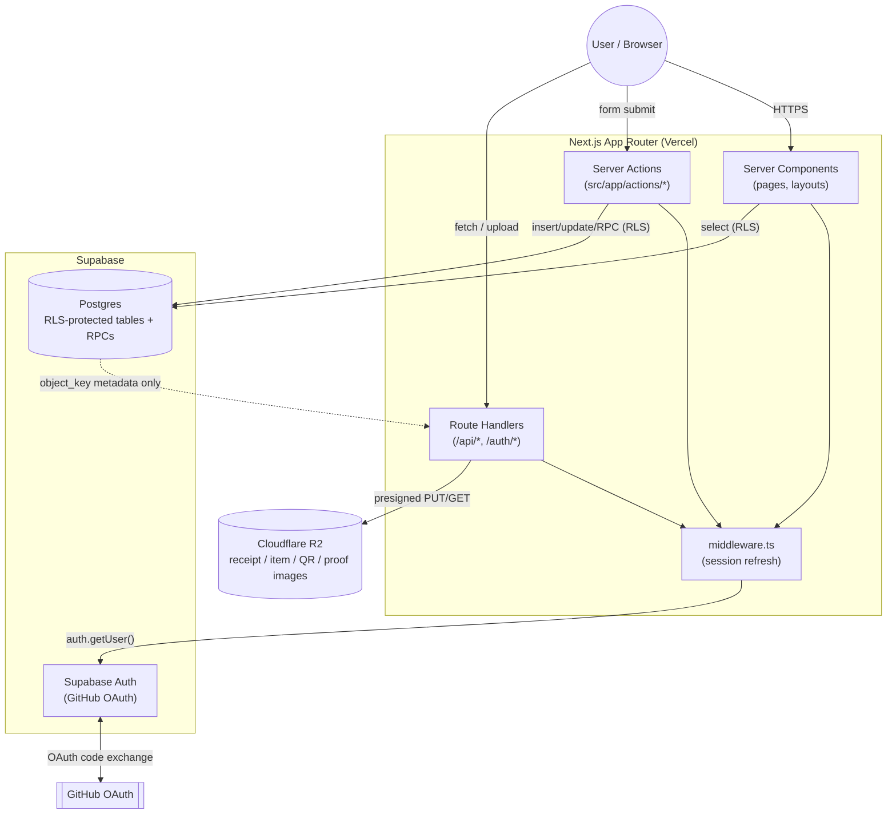

### 18.2 Entity Relationship Diagram

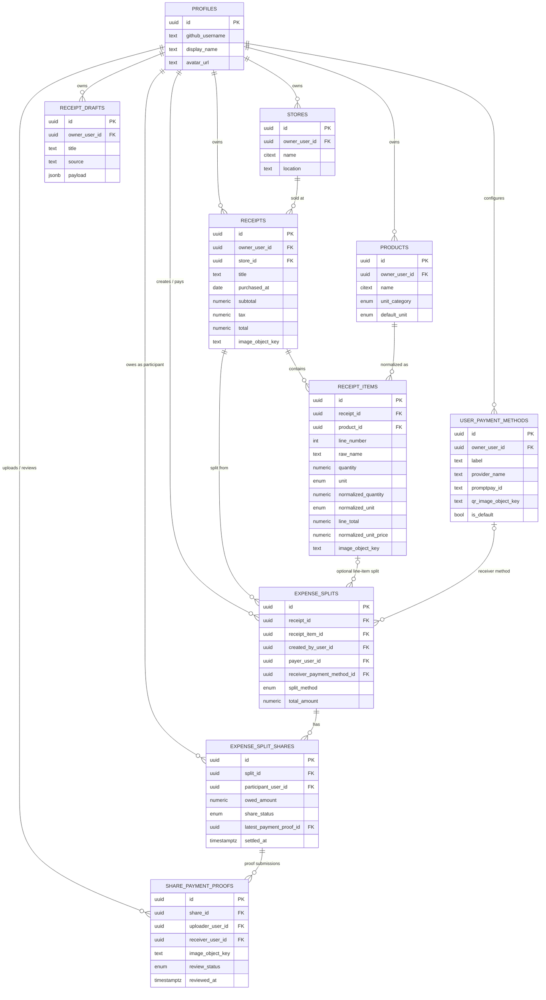

### 18.3 Site Map

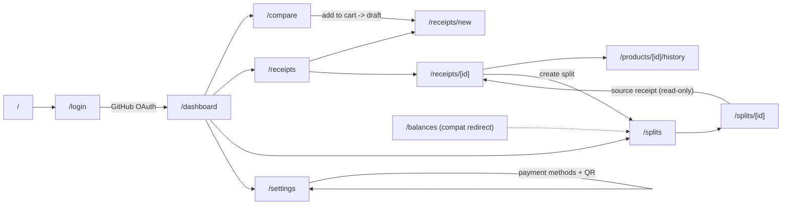

### 18.4 Authentication Sequence

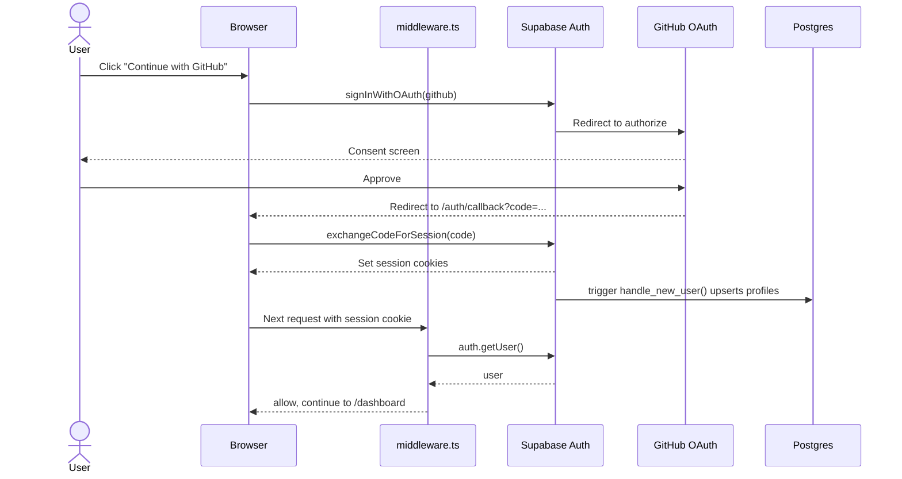

### 18.5 Receipt Draft Lifecycle

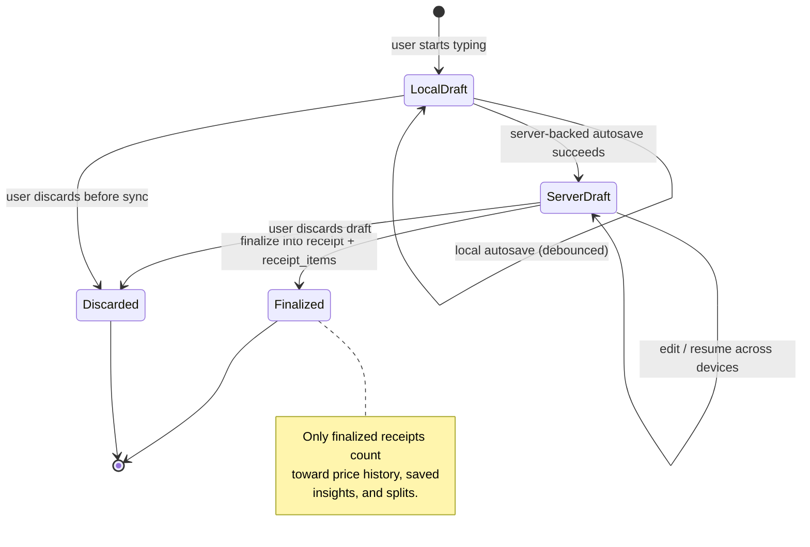

### 18.6 Compare → Cart → Receipt Draft Flow

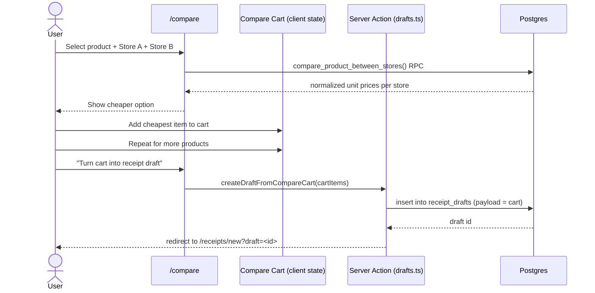

### 18.7 Split Creation Flow

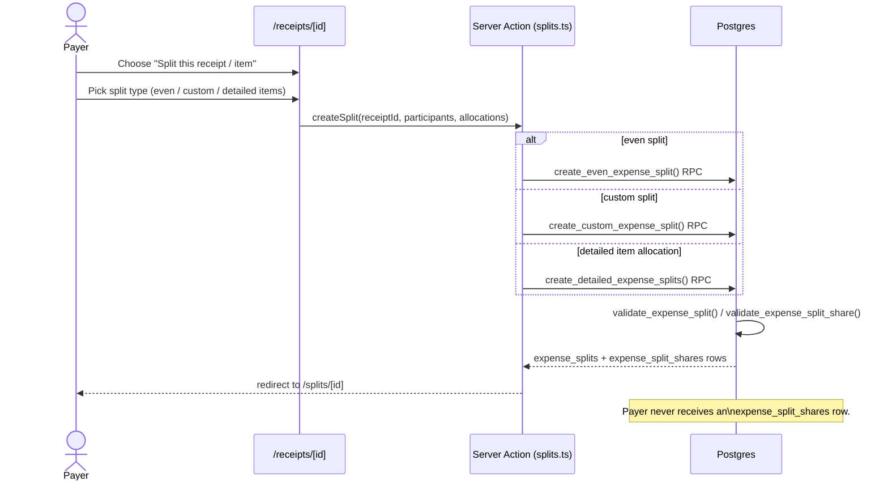

### 18.8 Payment Proof Submission & Review

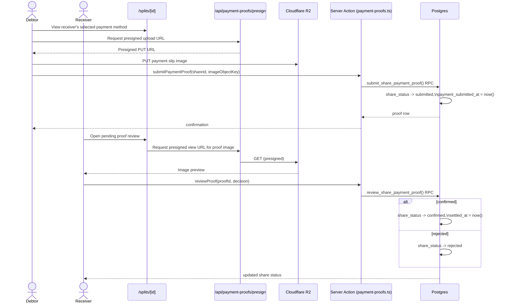

### 18.9 Split Share Status State Machine

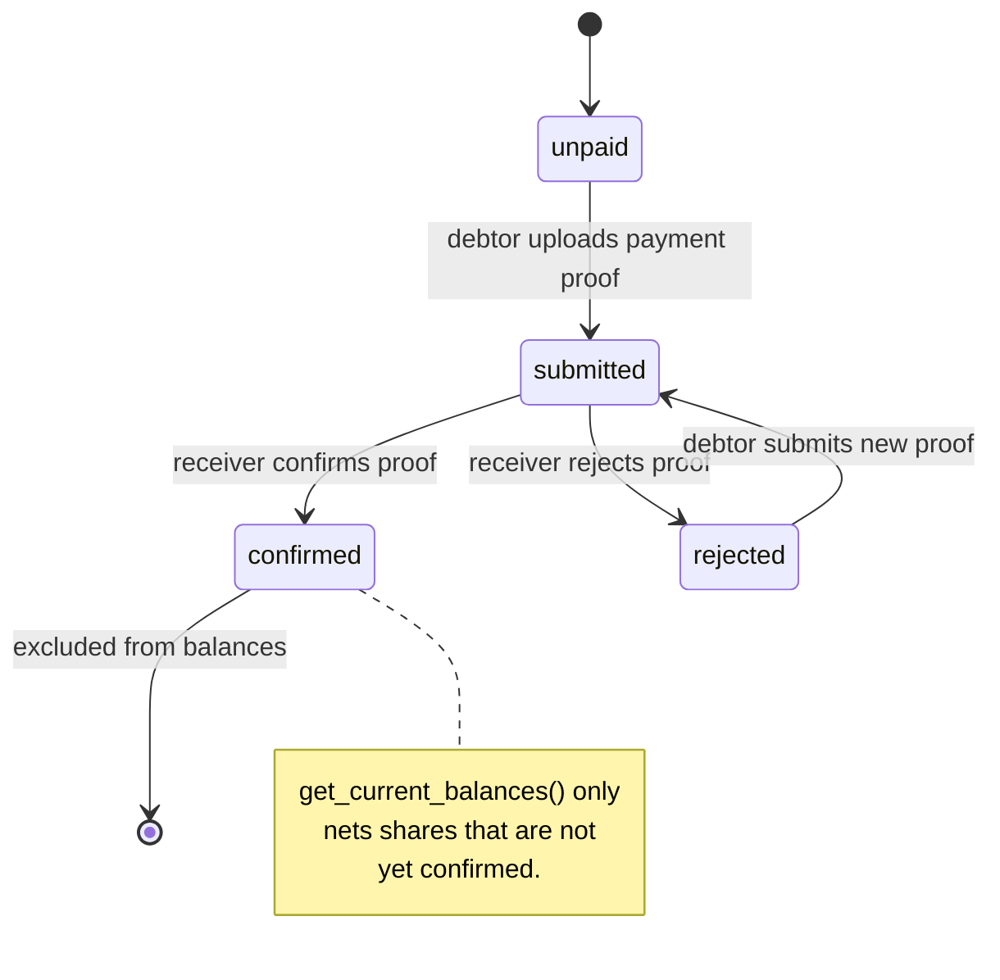

### 18.10 Image Upload Pattern (generic)

Receipt, item, QR, and payment-proof images all follow the same presign pattern; only the route and ownership check differ.

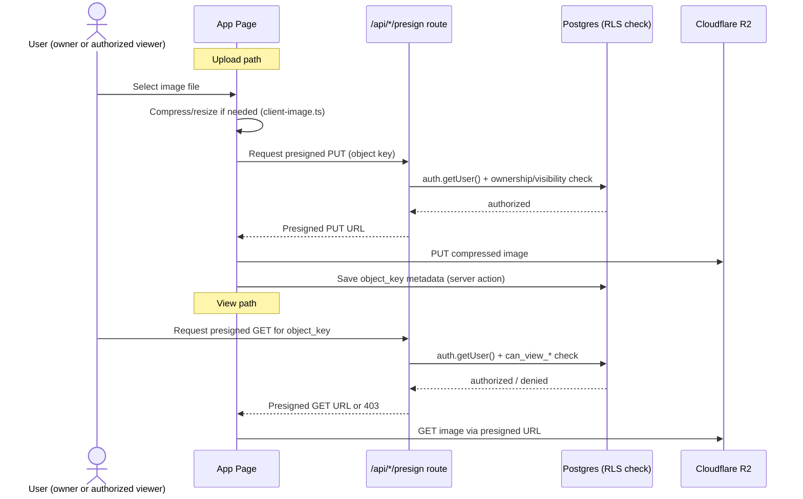

### 18.11 Balance Derivation

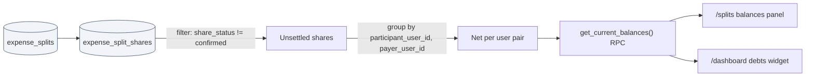

### 18.12 Data Ownership & Access Boundaries

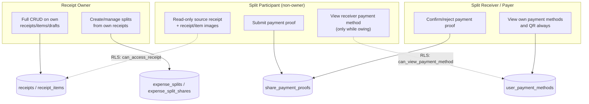
